  

    

  
    

  <i>"I focus on building scalable systems, writing clean code, and creating intuitive user experiences."</i>
    

---

### ✦ Profile & Focus

I am a software developer balancing my computer science studies with hands-on experience in full-stack architecture. I appreciate well-structured logic, resilient backends, and seamless cross-platform functionality.

* **Collaboration:** Partnering on ambitious, full-stack Java web applications.
* **Current Focus:** Bridging the gap between web and mobile architecture, mastering native mobile development to build highly performant utilities.
* **Continuous Learning:** Exploring scaling backend ecosystems, pushing Java and Spring Boot to handle complex data efficiently.
* **Conversations:** Open to discussing backend architecture, structuring REST APIs, and transitioning between Java and TypeScript.
* **Off-Screen:** When I step away from my studies, I spend my time practicing fingerstyle acoustic guitar and learning piano, or unwinding with slice-of-life narratives.

 

### ✦ Technologies & Tools

  
  
  
  
  
  
  

  
  
  
  
  

  
  
  
  
  

 

  

### ✦ Development Analytics

  
  

 

  

 
